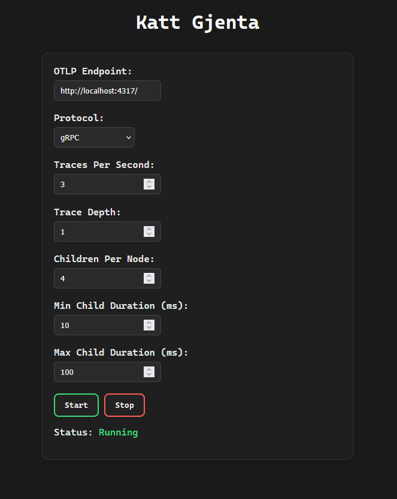

# KattGjenta

A simple OTLP trace generator, which can be useful for debugging collectors.  

## Features

- Generate parent and child spans recursively
- Configurable trace time, trace depth, and number of children per node
- Supports OTLP export over:
  - gRPC
  - HTTP/Protobuf